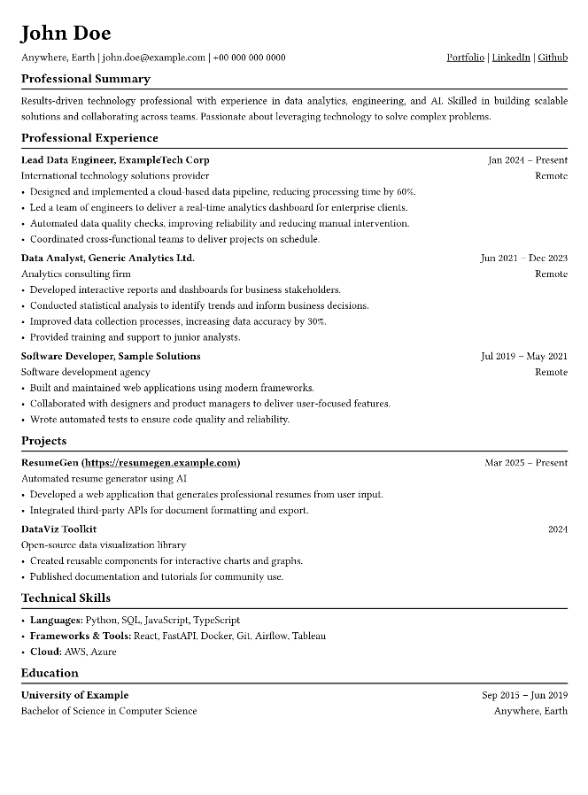

# awesome-typst-resume

This repository provides a clean and customizable resume template built with Typst. It is designed to help you quickly create a professional-looking CV with minimal effort right inside your IDE. Feel free to use this template as a starting point for your own resume and explore the additional resources and examples linked below for further inspiration.

### Prerequisite
To use and preview Typst files directly in your IDE, please install the [TinyMist VS Code extension](https://marketplace.visualstudio.com/items?itemName=myriad-dreamin.tinymist). This extension enables Typst support and live preview within Visual Studio Code.

Here is my resume template:

### Checkout more good typst resumes templates:

Templates on typst.app
- https://typst.app/universe/package/basic-resume
- https://typst.app/universe/package/chicv
- https://typst.app/universe/package/imprecv
- https://typst.app/universe/package/finely-crafted-cv
- https://typst.app/universe/package/modern-cv
- https://typst.app/universe/package/modernpro-cv
- https://typst.app/universe/package/silver-dev-cv
- https://typst.app/universe/package/simple-technical-resume

Templates on github
- https://github.com/bamboovir/typst-resume-template
- https://github.com/mizlan/typst-resume-sans
- https://github.com/davidcarayon/cv-typst
- https://github.com/nik-rev/typst-resume
- https://github.com/KiranWells/hackable-typst-resume/tree/main
- https://github.com/crystalsolenoid/typst-resume-template

### Need more inspiration? Checkout the links below:

Other Templates (Non-typst)
- https://blog.pragmaticengineer.com/the-pragmatic-engineers-resume-template/
- https://www.overleaf.com/latex/templates/software-engineer-resume/gqxmqsvsbdjf
- https://careerservices.fas.harvard.edu/resources/bullet-point-resume-template/
- https://capd.mit.edu/channels/make-a-resume-cover-letter-cv/
- https://ocs.yale.edu/resources/ocs-resume-template/
- https://career.berkeley.edu/prepare-for-success/resumes/sample-resumes/
- https://careerdevelopment.princeton.edu/guides/resume-cv-cover-letter-diversity-statement
- https://career.caltech.edu/learn/resume-tips
- https://careerhub.students.duke.edu/undergraduate-resume-examples/
- https://imagine.jhu.edu/resources/resumes-cover-letters-and-interviewing/
- https://www.careereducation.columbia.edu/topics/resumes-cvs-home
- https://www.careers.ox.ac.uk/cvs#collapse1542711
- https://www.careers.cam.ac.uk/applying-for-jobs/cvs-and-cover-letters
- https://www.imperial.ac.uk/careers/applications-and-interviews/cv/
- https://www.ucl.ac.uk/careers/applying/applications
